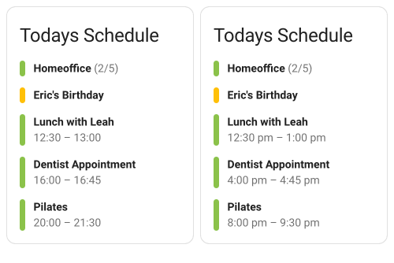

# Today Card for Home Assistant

[![HACS][hacs-badge]][hacs-url]
[![Release][release-badge]][releases-url]

[![Open in your Home Assistant instance][my-ha-badge]][my-ha-url]

<picture>
  <source media="(prefers-color-scheme: dark)" srcset="docs/preview-dark.png">
  
</picture>

## Installation

### HACS

Since **Today Card** is not yet available through the HACS store, you have to add it as a custom repository. After this initial step, the installation und future updates work the same as with any other HACS project.

1. Navigate to the HACS Dashboard] in your instance and click the three dots in the top right corner.
2. Select _Custom Repositories_ and add **Today Card**
   - Repository: `JonasDoebertin/ha-today-card`
   - Type: `Dashboard`
3. Click _Add_ to add **Today Card** to the list of your HACS repositories.
4. Add the `custom:today-card` to your Dashboard like any other card (using either editor or YAML configuration).

### Manual

1. Download the `ha-today-card.js` file from the [latest release][latest-release-url].
2. Put the `ha-today-card.js` file into your `config/www` folder.
3. Go to _Configuration_ → _Lovelace Dashboards_ → _Resources_ → Click Plus button
   - Set _Url_ as `/local/ha-today-card.js`
   - Set _Resource type_ as `JavaScript Module`.
4. Add the `custom:today-card` to your Dashboard like any other card (using either editor or YAML configuration).

## Configuration

The card can be configured via a fully featured visual UI editor or via YAML.

### Minimal YAML Configuration

```yaml
type: custom:today-card
entities:
  - calendar.your_calendar
```

### Full YAML Configuration

```yaml
type: custom:today-card
title: "Today's Schedule"
advance: 4
show_all_day_events: true
show_past_events: false
time_format: "HH:mm"
fallback_color: teal
entities:
  - entity: calendar.your_calendar_1
    color: "#1abcf2"
  - entity: calendar.your_calendar_2
    color: pink
```

### Configuration Options

#### Main Options

| Name                  | Type            | Requirement  | Default   | Description                                                                                                                                                                     |
|-----------------------|-----------------|--------------|-----------|---------------------------------------------------------------------------------------------------------------------------------------------------------------------------------|
| `type`                | string          | **Required** |           | `custom:today-card`                                                                                                                                                             |
| `entities`            | list of objects | **Required** |           | Either a simple list of calendar entities (see [minimal configuration](#Minimal-YAML-Configuration) example) or a list of objects (see [Calendar Entities](#Calendar-Entities)) |
| `title`               | string          | Optional     | `""`      | Card title (if empty, no card title will be shown)                                                                                                                              |
| `advance`             | number          | Optional     | `0`       | Allows to display the schedule of another day then today, eg. `1` for tomorrows events, `2` for the day after tomorrow, and `-1` for yesterdays events                          |
| `show_all_day_events` | boolean         | Optional     | `true`    | Whether to show all day events in the schedule                                                                                                                                  |
| `show_past_events`    | boolean         | Optional     | `false`   | Whether to include past events in the schedule                                                                                                                                  |
| `time_format`         | string          | Optional     | `HH:mm`   | Define a custom format for displaying the events start and end times (see [time formats](#Time-Formatting))                                                                     |
| `fallback_color`      | string          | Optional     | `primary` | Color to use as a fallback, eg. when no events are left for the day (see [colors](#Colors))                                                                                     |

#### Calendar Entities

Calendar entities can either be provided as a simple list of calendar entities (see [minimal configuration](#Minimal-YAML-Configuration) example) or a list of objects following the below-mentioned structure.

| Name     | Type   | Required     | Default | Description                                                                                                                                                    |
|----------|--------|--------------|---------|----------------------------------------------------------------------------------------------------------------------------------------------------------------|
| `entity` | string | **Required** |         | An entity id of the `calendar.*` domain                                                                                                                        |
| `color`  | string | Optional     |         | The calendars color in the schedule (see [colors](#Colors)). If no color is specified, a color from the list of available colors will be chosen automatically. |

#### Time Formatting

With the `time_format` configuration option, you can change how the events start and end times are being displayed. Choose from the following formatting placeholders:

| Format | Output | Description                       |
|--------|--------|-----------------------------------|
| `H`    | 0-23   | The hour                          |
| `HH`   | 00-23  | The hour, 2-digits                |
| `h`    | 1-12   | The hour, 12-hour clock           |
| `hh`   | 01-12  | The hour, 12-hour clock, 2-digits |
| `m`    | 0-59   | The minute                        |
| `mm`   | 00-59  | The minute, 2-digits              |
| `A`    | AM PM  |                                   |
| `a`    | am pm  |                                   |

Using those in combination can result in the following common formats:

| Format    | Output   |
|-----------|----------|
| `H:mm`    | 8:02     |
| `HH:mm`   | 08:02    |
| `h:mm A`  | 8:02 AM  |
| `hh:mm A` | 08:02 AM |
| `h:mm a`  | 8:02 am  |
| `hh:mm a` | 08:02 am |

#### Colors

The card generally use Home Assistants default colors, which can be overwritten by your theme. Any of the following values can be used as a color in the cards configuration.

You can also directly specify a hex color code instead, e.g. `color: "#1abcf2"`.

| Name            | Used CSS Variable       | HA default value |
|-----------------|-------------------------|------------------|
| `primary`       | `--primary-color`       | `#03a9f4`        |
| `dark-primary`  | `--dark-primary-color`  | `#0288d1`        |
| `light-primary` | `--light-primary-color` | `#b3e5fc`        |
| `accent`        | `--accent-color`        | `#ff9800`        |
| `disabled`      | `--disabled-color`      | `#bdbdbd`        |
| `red`           | `--red-color`           | `#f44336`        |
| `pink`          | `--pink-color`          | `#e91e63`        |
| `purple`        | `--purple-color`        | `#926bc7`        |
| `deep-purple`   | `--deep-purple-color`   | `#6e41ab`        |
| `indigo`        | `--indigo-color`        | `#3f51b5`        |
| `blue`          | `--blue-color`          | `#2196f3`        |
| `light-blue`    | `--light-blue-color`    | `#03a9f4`        |
| `cyan`          | `--cyan-color`          | `#00bcd4`        |
| `teal`          | `--teal-color`          | `#009688`        |
| `green`         | `--green-color`         | `#4caf50`        |
| `light-green`   | `--light-green-color`   | `#8bc34a`        |
| `lime`          | `--lime-color`          | `#cddc39`        |
| `yellow`        | `--yellow-color`        | `#ffeb3b`        |
| `amber`         | `--amber-color`         | `#ffc107`        |
| `orange`        | `--orange-color`        | `#ff9800`        |
| `deep-orange`   | `--deep-orange-color`   | `#ff6f22`        |
| `brown`         | `--brown-color`         | `#795548`        |
| `light-grey`    | `--light-grey-color`    | `#bdbdbd`        |
| `grey`          | `--grey-color`          | `#9e9e9e`        |
| `dark-grey`     | `--dark-grey-color`     | `#606060`        |
| `blue-grey`     | `--blue-grey-color`     | `#607d8b`        |
| `black`         | `--black-color`         | `#000000`        |
| `white`         | `--white-color`         | `#ffffff`        |

## Custom Styling

The HTML structure of the card with its listed events is kept quite simple. It is a deliberate decision to avoid complex structures and styles and instead make it as easy as possible to adapt the styles to your own ideas.

The markup of an event within the card looks like the follwoing:

```html
<div class="event [additional classes, see below]">
    <div class="indicator"></div>
    <div class="details">
        <p class="title">
            <strong>Home-Office</strong>
            <span>(2/5)</span>
        </p>
        <p class="schedule">12:30 – 13:00</p>
    </div>
</div>
```

As Today Card was built with custom styling in mind, it fully supports [card-mod][card-mod-url] and has some useful css classes being applied to the individual events to make applying custom style easy. The following classes are available:

| Class           | Description                             |
|-----------------|-----------------------------------------|
| `.is-all-day`   | Event spans the whole day               |
| `.is-multi-day` | Event spans multiple days               |
| `.is-first-day` | It's the first day of a multi day event |
| `.is-last-day`  | It's the last day of a multi day event  |
| `.is-in-past`   | Event ended in the past                 |
| `.is-in-future` | Event will start in the future          |
| `.is-current`   | Event is happening right now            |

If you wanted to highlight events happening right now, you could add a bit of a muting effect on events in the past, the future and on all day events. That could look like so:

```yaml
...

card_mod:
  style: |
    .is-all-day, .is-in-past, .is-in-future {
      opacity: 0.5;
    }
```

<!-- Badges -->

[hacs-badge]: https://img.shields.io/badge/HACS-Default-41BDF5.svg?style=for-the-badge
[release-badge]: https://img.shields.io/github/v/release/JonasDoebertin/ha-today-card?style=for-the-badge
[my-ha-badge]: https://my.home-assistant.io/badges/hacs_repository.svg

<!-- References -->

[hacs-url]: https://github.com/hacs/integration
[my-ha-url]: https://my.home-assistant.io/redirect/hacs_repository/?owner=JonasDoebertin&repository=ha-today-card
[releases-url]: https://github.com/JonasDoebertin/ha-today-card/releases
[latest-release-url]: https://github.com/JonasDoebertin/ha-today-card/releases/latest
[card-mod-url]: https://github.com/thomasloven/lovelace-card-mod
