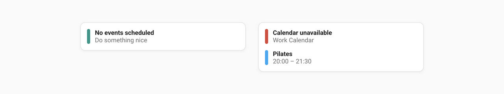
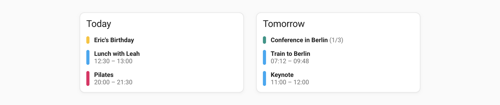

<div align="center">

# Today Card for Home Assistant

**A Lovelace card that shows one day of your calendars as a plain list.**

[![HACS][hacs-badge]][hacs-url]
[![Release][release-badge]][releases-url]
[![Build][build-badge]][build-url]
[![License][license-badge]][license-url]

[![Open in your Home Assistant instance][my-ha-badge]][my-ha-url]

<picture>
  <source media="(prefers-color-scheme: dark)" srcset="https://raw.githubusercontent.com/JonasDoebertin/ha-today-card/main/docs/preview-dark.png">
  
</picture>

[Installation](#installation) · [Quick start](#quick-start) · [Configuration](#configuration) · [Styling](#custom-styling) · [Recipes](#recipes)

</div>

## What it does

Home Assistant's built-in calendar card shows a month, a week or the next few days. Today Card deliberately shows less: the events of a single day, as a list, in the order they happen.

Point it at one or more calendars and it renders today's schedule, one colour per calendar, all-day events first.

- Several calendars in one list, each in its own colour. Pick the colours or let the card assign them.
- All-day events sit at the top. Multi-day events carry a day counter such as `(2/5)`.
- `advance` moves the card to tomorrow, to the day after, or back to yesterday, so one dashboard can show several days side by side.
- `exclude` drops recurring clutter by plain text or regular expression, `limit` caps the list, and `show_past_events` decides whether the morning stays visible all afternoon.
- The visual editor covers every option. On Home Assistant 2026.6 and newer, the card offers itself in the picker once you select a calendar entity.
- The markup is flat and the class names are stable, so [card-mod][card-mod-url] restyling stays short. Spacing is exposed as CSS variables.
- When a calendar cannot be reached, the card names it rather than showing an empty day.
- Translated into English, German, Spanish, French and Italian.

## Installation

### HACS

**Today Card** is available in the HACS default store.

1. Open **HACS** in your Home Assistant instance and search for **Today Card**.
2. Click **Download** and restart Home Assistant if HACS asks you to.
3. Add `custom:today-card` to your dashboard like any other card, via the card picker or YAML.

Or use the button that takes you straight there:

[![Open in your Home Assistant instance][my-ha-badge]][my-ha-url]

### Manual

1. Download the `ha-today-card.js` file from the [latest release][latest-release-url].
2. Put the `ha-today-card.js` file into your `config/www` folder.
3. Go to _Settings_ → _Dashboards_ → _Resources_ → click the plus button
   - Set _Url_ to `/local/ha-today-card.js`
   - Set _Resource type_ to `JavaScript Module`
4. Add `custom:today-card` to your dashboard like any other card, via the card picker or YAML.

## Quick start

```yaml
type: custom:today-card
entities:
  - calendar.your_calendar
```

That is a working card. Everything below is optional.

## Configuration

The card can be configured through a fully featured visual editor or in YAML.

<details>
<summary><strong>A configuration using every available option</strong></summary>

```yaml
type: custom:today-card
title: "Today's Schedule"
advance: 4
show_all_day_events: true
show_past_events: false
limit: 3
exclude:
  - "Trash Day"
  - '/^Team \d+ Standup/'
time_format: "HH:mm"
fallback_color: teal
entities:
  - entity: calendar.your_calendar_1
    color: "#1abcf2"
  - entity: calendar.your_calendar_2
    color: pink
tap_action:
    action: navigate
    navigation_path: /calendar
```

</details>

### Main options

| Name                  | Type            | Requirement  | Default   | Description                                                                                                                                                                     |
|-----------------------|-----------------|--------------|-----------|---------------------------------------------------------------------------------------------------------------------------------------------------------------------------------|
| `type`                | string          | **Required** |           | `custom:today-card`                                                                                                                                                             |
| `entities`            | list of objects | **Required** |           | Either a simple list of calendar entities (see [quick start](#quick-start)) or a list of objects (see [calendar entities](#calendar-entities)) |
| `title`               | string          | Optional     | `""`      | Card title (if empty, no card title will be shown)                                                                                                                              |
| `advance`             | number          | Optional     | `0`       | Allows to display the schedule of another day then today, eg. `1` for tomorrows events, `2` for the day after tomorrow, and `-1` for yesterdays events                          |
| `show_all_day_events` | boolean         | Optional     | `true`    | Whether to show all day events in the schedule                                                                                                                                  |
| `show_past_events`    | boolean         | Optional     | `false`   | Whether to include past events in the schedule                                                                                                                                  |
| `limit`               | number          | Optional     | `0`       | Limits the number of events to display, the default `0` means no limiting                                                                                                       |
| `exclude`             | list of strings | Optional     | `[]`      | Patterns that hide an event when they match its title or description. Plain text matches case-insensitively anywhere in the value; a pattern wrapped in `/slashes/` is treated as a regular expression (see [excluding events](#excluding-events))   |
| `time_format`         | string          | Optional     | `HH:mm`   | Define a custom format for displaying the events start and end times (see [time formatting](#time-formatting))                                                                     |
| `fallback_color`      | string          | Optional     | `primary` | Color to use as a fallback, eg. when no events are left for the day (see [colors](#colors))                                                                                     |
| `tap_action`          | action          | Optional     | `none`    | Home assistant [action](https://www.home-assistant.io/dashboards/actions/) to perform on card taps (supports `perform-action`, `navigate`, `url` and `fire-dom-event` actions)  |

### Calendar entities

Calendar entities can either be provided as a simple list of calendar entities (see [quick start](#quick-start)) or a list of objects following the below-mentioned structure.

| Name     | Type   | Required     | Default | Description                                                                                                                                                    |
|----------|--------|--------------|---------|----------------------------------------------------------------------------------------------------------------------------------------------------------------|
| `entity` | string | **Required** |         | An entity id of the `calendar.*` domain                                                                                                                        |
| `color`  | string | Optional     |         | The calendars color in the schedule (see [colors](#colors)). If no color is specified, a color from the list of available colors will be chosen automatically. |

### Excluding events

Use `exclude` to hide recurring noise, such as a bin collection reminder or a daily stand-up. Each pattern is checked against both the title and the description of an event, and one match is enough to hide it.

A plain pattern matches case-insensitively anywhere in the text, so `standup` also hides `Daily Standup`.

```yaml
exclude:
  - Trash Day
  - standup
```

A pattern wrapped in slashes is a regular expression, with optional flags after the closing slash. Write these as single-quoted YAML strings, otherwise a backslash sequence such as `\d` makes the dashboard configuration fail to parse.

```yaml
exclude:
  - '/^Team \d+ Standup/'
  - '/vacation/i'
```

A pattern that looks like a regular expression but does not compile falls back to a plain text search for whatever sits between the slashes.

### Time formatting

With the `time_format` configuration option, you can change how the events start and end times are being displayed. Choose from the following formatting placeholders:

| Format | Output | Description                       |
|--------|--------|-----------------------------------|
| `H`    | 0-23   | The hour                          |
| `HH`   | 00-23  | The hour, 2-digits                |
| `h`    | 1-12   | The hour, 12-hour clock           |
| `hh`   | 01-12  | The hour, 12-hour clock, 2-digits |
| `m`    | 0-59   | The minute                        |
| `mm`   | 00-59  | The minute, 2-digits              |
| `A`    | AM PM  |                                   |
| `a`    | am pm  |                                   |

Using those in combination can result in the following common formats:

| Format    | Output   |
|-----------|----------|
| `H:mm`    | 8:02     |
| `HH:mm`   | 08:02    |
| `h:mm A`  | 8:02 AM  |
| `hh:mm A` | 08:02 AM |
| `h:mm a`  | 8:02 am  |
| `hh:mm a` | 08:02 am |

### Colors

The card generally uses Home Assistants default colors, which can be overwritten by your theme. Any of the names below can be used as a color in the cards configuration, and you can also specify a hex color code directly, e.g. `color: "#1abcf2"`.

<details>
<summary><strong>All available color names</strong></summary>

| Name            | Used CSS Variable       | HA default value |
|-----------------|-------------------------|------------------|
| `primary`       | `--primary-color`       | `#03a9f4`        |
| `dark-primary`  | `--dark-primary-color`  | `#0288d1`        |
| `light-primary` | `--light-primary-color` | `#b3e5fc`        |
| `accent`        | `--accent-color`        | `#ff9800`        |
| `disabled`      | `--disabled-color`      | `#bdbdbd`        |
| `red`           | `--red-color`           | `#f44336`        |
| `pink`          | `--pink-color`          | `#e91e63`        |
| `purple`        | `--purple-color`        | `#926bc7`        |
| `deep-purple`   | `--deep-purple-color`   | `#6e41ab`        |
| `indigo`        | `--indigo-color`        | `#3f51b5`        |
| `blue`          | `--blue-color`          | `#2196f3`        |
| `light-blue`    | `--light-blue-color`    | `#03a9f4`        |
| `cyan`          | `--cyan-color`          | `#00bcd4`        |
| `teal`          | `--teal-color`          | `#009688`        |
| `green`         | `--green-color`         | `#4caf50`        |
| `light-green`   | `--light-green-color`   | `#8bc34a`        |
| `lime`          | `--lime-color`          | `#cddc39`        |
| `yellow`        | `--yellow-color`        | `#ffeb3b`        |
| `amber`         | `--amber-color`         | `#ffc107`        |
| `orange`        | `--orange-color`        | `#ff9800`        |
| `deep-orange`   | `--deep-orange-color`   | `#ff6f22`        |
| `brown`         | `--brown-color`         | `#795548`        |
| `light-grey`    | `--light-grey-color`    | `#bdbdbd`        |
| `grey`          | `--grey-color`          | `#9e9e9e`        |
| `dark-grey`     | `--dark-grey-color`     | `#606060`        |
| `blue-grey`     | `--blue-grey-color`     | `#607d8b`        |
| `black`         | `--black-color`         | `#000000`        |
| `white`         | `--white-color`         | `#ffffff`        |

</details>

## Custom styling

The HTML structure of the card with its listed events is kept quite simple. It is a deliberate decision to avoid complex structures and styles and instead make it as easy as possible to adapt the styles to your own ideas.

The markup of an event within the card looks like the following:

```html
<div class="event [additional classes, see below]">
    <div class="indicator"></div>
    <div class="details">
        <p class="title">
            <strong>Home-Office</strong>
            <span>(2/5)</span>
        </p>
        <p class="schedule">12:30 – 13:00</p>
    </div>
</div>
```

As Today Card was built with custom styling in mind, it fully supports [card-mod][card-mod-url] and applies a number of classes to the individual events:

| Class           | Description                             |
|-----------------|-----------------------------------------|
| `.is-all-day`   | Event spans the whole day               |
| `.is-multi-day` | Event spans multiple days               |
| `.is-first-day` | It's the first day of a multi day event |
| `.is-last-day`  | It's the last day of a multi day event  |
| `.is-in-past`   | Event ended in the past                 |
| `.is-in-future` | Event will start in the future          |
| `.is-current`   | Event is happening right now            |

Two further rows can appear in place of an event. `.is-fallback` carries the message shown when the day has nothing on it, and `.is-error` names any calendar Home Assistant could not reach.



Spacing and the size of the colored indicator are CSS variables, so a denser or airier card does not need any selector at all:

| Variable                  | Default   | Description                               |
|---------------------------|-----------|-------------------------------------------|
| `--tc-spacing`            | `1rem`    | Vertical gap between two events           |
| `--tc-indicator-spacing`  | `0.75rem` | Gap between the indicator and the details |
| `--tc-indicator-width`    | `0.5rem`  | Width of the colored indicator            |

## Recipes

Highlight what is happening right now by muting everything else.

```yaml
card_mod:
  style: |
    .is-all-day, .is-in-past, .is-in-future {
      opacity: 0.5;
    }
```

Fit more events into less space by tightening the spacing variables.

```yaml
card_mod:
  style: |
    :host {
      --tc-spacing: 0.5rem;
      --tc-indicator-width: 0.25rem;
    }
```

Put today and tomorrow next to each other with `advance` and a grid.

```yaml
type: grid
columns: 2
square: false
cards:
  - type: custom:today-card
    title: Today
    entities:
      - calendar.family
  - type: custom:today-card
    title: Tomorrow
    advance: 1
    entities:
      - calendar.family
```



Open the calendar panel when someone taps the card.

```yaml
type: custom:today-card
entities:
  - calendar.family
tap_action:
  action: navigate
  navigation_path: /calendar
```

## Contributing

Bug reports, feature ideas and pull requests are all welcome. [CONTRIBUTING.md](CONTRIBUTING.md) covers the development setup, the test suite and what a good pull request looks like here.

If you speak a language the card does not yet speak, a translation file is a small and very welcome first contribution.

## Support

If the card is useful to you, a star helps other people find it. If you want to go further than that, there is a [Ko-fi page][ko-fi-url].

Released under the [MIT license](LICENSE).

<!-- Badges -->

[hacs-badge]: https://img.shields.io/badge/HACS-Default-41BDF5.svg?style=for-the-badge
[release-badge]: https://img.shields.io/github/v/release/JonasDoebertin/ha-today-card?style=for-the-badge
[build-badge]: https://img.shields.io/github/actions/workflow/status/JonasDoebertin/ha-today-card/build.yml?branch=main&style=for-the-badge
[license-badge]: https://img.shields.io/github/license/JonasDoebertin/ha-today-card?style=for-the-badge
[my-ha-badge]: https://my.home-assistant.io/badges/hacs_repository.svg

<!-- References -->

[hacs-url]: https://github.com/hacs/integration
[build-url]: https://github.com/JonasDoebertin/ha-today-card/actions/workflows/build.yml
[license-url]: https://github.com/JonasDoebertin/ha-today-card/blob/main/LICENSE
[my-ha-url]: https://my.home-assistant.io/redirect/hacs_repository/?owner=JonasDoebertin&repository=ha-today-card
[releases-url]: https://github.com/JonasDoebertin/ha-today-card/releases
[latest-release-url]: https://github.com/JonasDoebertin/ha-today-card/releases/latest
[card-mod-url]: https://github.com/thomasloven/lovelace-card-mod
[ko-fi-url]: https://ko-fi.com/dieserjonas
